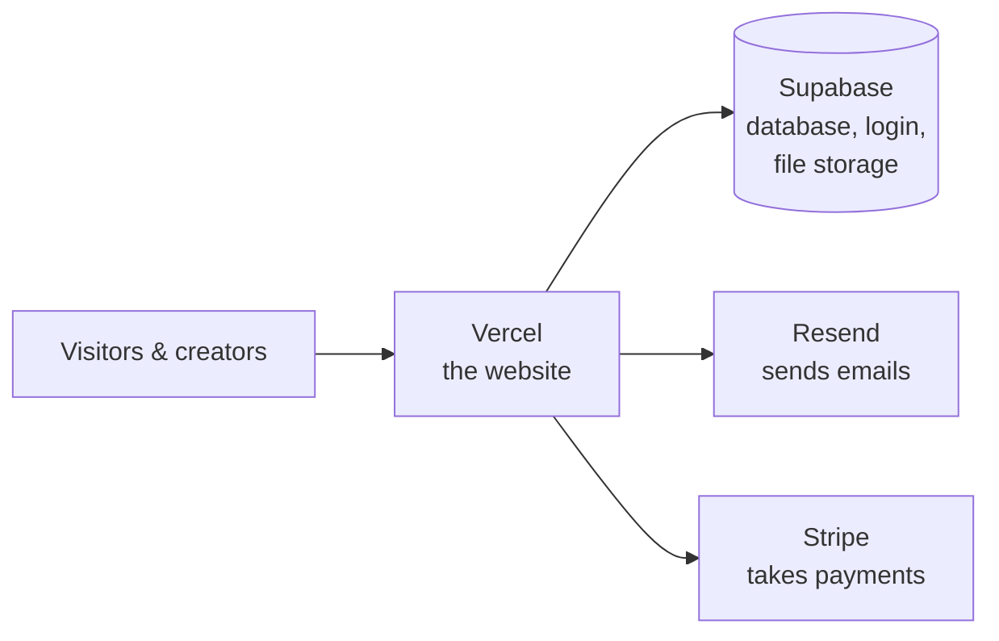
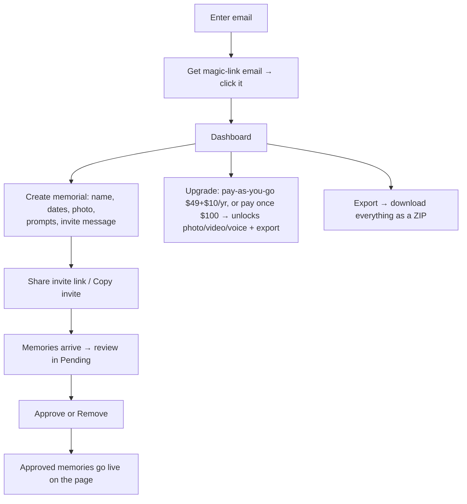
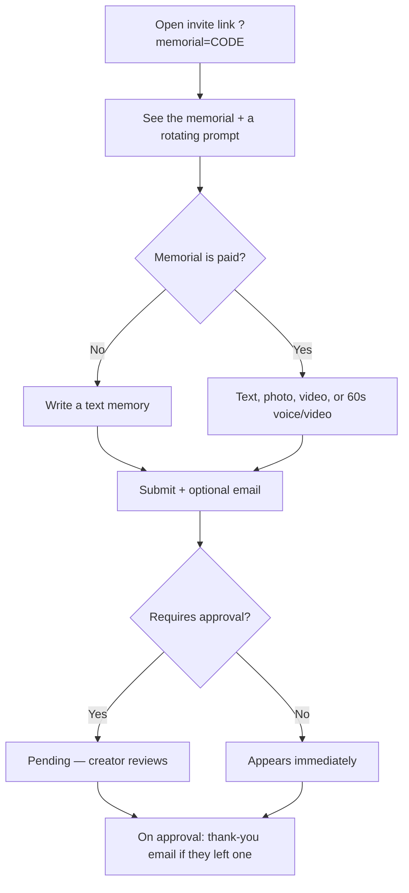
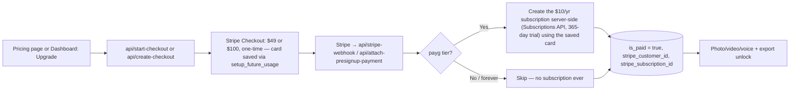
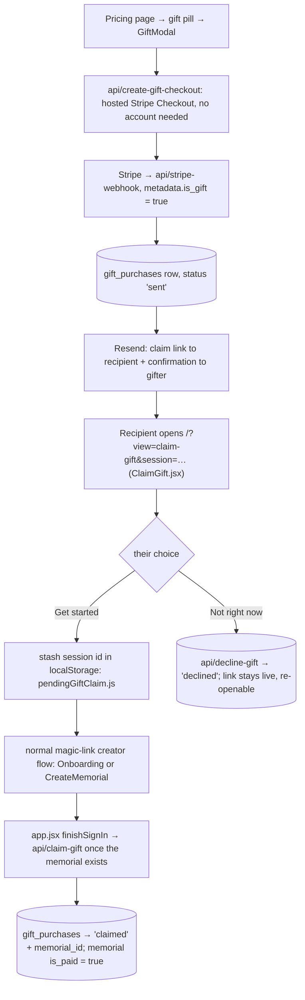

# And Then — The Complete Guide

A plain-English guide to how this site works and how to change it with Claude.
If you're picking this up to build on it: read this once, then keep
[CLAUDE.md](CLAUDE.md) open (that's the file Claude reads to learn the rules).

- **What it is:** a memorial site. Someone creates a page for a person who died,
  shares one link, and friends/family add memories (stories, photos, video,
  voice). The creator approves what appears.
- **Live at:** myandthen.com

---

## 1. The four moving parts

You don't run any servers. The site is stitched together from four services:



| Part | What it does | Where you manage it |
|---|---|---|
| **Vercel** | Hosts the website; runs the small backend functions in `api/` | vercel.com → project `andthen-civ6` |
| **Supabase** | The database, magic-link login, and photo/video/voice storage | supabase.com → "And Then" project |
| **Resend** | Sends the thank-you / notification / anniversary emails | resend.com → the `staciharv` workspace |
| **Stripe** | Collects the upgrade payment (two tiers — see §4) | dashboard.stripe.com |
| **Domain (DNS)** | myandthen.com | Squarespace (DNS served by Google) |

**The app itself** is React (built with Vite). One page per file. There is **no
separate backend server** — the few server bits are small "serverless functions"
in the `api/` folder that Vercel runs on demand.

---

## 2. Who can do what

- **Creator (steward):** signs in with a magic link (no password), creates a
  memorial, moderates memories, can upgrade to paid. Owns the memorial.
- **Contributor:** never signs in. Opens the invite link, adds a memory.
- **Visitor:** opens the memorial link, reads the approved memories.

---

## 3. The user journeys (how it works today)

### Creator


### Contributor (no account)


### Visitor
Opens `myandthen.com/?memorial=CODE` → sees the person's page and all **approved**
memories. That's it — no login, and the link works forever.

---

## 4. Free vs. Paid

| | Free | Paid — **per memorial, two ways to pay** |
|---|---|---|
| Memorial page + 1 cover photo | ✓ | ✓ |
| Prompts + text memories | ✓ | ✓ |
| **Photo / video / voice** memories | — | ✓ |
| **Export** everything (ZIP) | — | ✓ |
| **Anniversary emails** | — | ✓ |

The creator pays; contributors never pay. Discount codes are supported (create
them in Stripe). Two tiers, same unlock either way:
- **Pay as you go** — $49 to build (unlimited entries/contributors, first
  year hosting included), then $10/yr to keep it live. This is a Stripe
  subscription with a 365-day trial on the $10/yr portion, so only the $49
  is actually charged at checkout — the first renewal charge is a year later.
- **Pay once** — $100, no subscription at all, nothing to renew ever.

See `api/_lib/stripeTiers.js` for the shared session-building logic both
`api/start-checkout.js` (pre-signup) and `api/create-checkout.js`
(post-signup, the Dashboard's Upgrade buttons) use.

---

## 5. The data (Supabase)

Two tables do the real work. Full structure is in
[`supabase/schema.sql`](supabase/schema.sql).

**`memorials`** — one row per memorial page:
- `name`, `born`, `passed`, `description`, `photo_url` — the basics
- `steward_id` — the creator's user id (who owns it)
- `invite_code` — the code in the share link (`?memorial=<code>`)
- `require_approval` — moderation on/off
- `prompts` (up to 3) / `prompt` (old single, kept for back-compat)
- `invite_message` — the message "Copy invite" copies
- `is_paid` — the paid upgrade flag (**only the payment system can set this**)

**`contributions`** — one row per memory:
- `memorial_id` — which memorial it belongs to
- `contributor_name`, `contributor_relation`, `contributor_email` (email is kept
  private — not readable by the public)
- `type` — `story` | `photo` | `video` | `voice`
- `text`, `media_url` — the content
- `status` — `pending` | `approved` | `rejected`
- `thanked_at`, `notified_at` — so emails send once

Photos/videos/voice files live in a Supabase **Storage** bucket called
`memorial-media`. (`profiles` is a leftover table the app doesn't use.)

### The safety rules (RLS)
Supabase uses "Row Level Security" so the public key can't do damage:
- Anyone can **read approved** memories and any memorial.
- Anyone can **submit** a memory (contributors have no account).
- Only a memorial's **creator** can see pending memories, approve/remove them,
  or edit the memorial.
- `is_paid` and contributor emails can **only** be set/read by the server, never
  from the browser.

**If a save silently does nothing, suspect a missing/incorrect RLS policy before
suspecting the code.**

---

## 6. The emails

**Sent by the app's own `api/*.js` functions, via the Resend API:**

| Email | When | To whom |
|---|---|---|
| **Thank-you** (`api/thank-you.js`) | a memory is approved (or auto-approved) and the contributor left an email | the contributor |
| **New-memory notice** (`api/notify-creator.js`) | a memory is submitted (max 5/day per memorial) | the creator |
| **Anniversary** (`api/anniversary-cron.js`) | daily check; on a birth/passing anniversary (paid only) | the creator |
| **Access request notice** (`api/notify-access-request.js`) | someone asks for access on an invite-only page | the creator |
| **Access approved** (`api/notify-access-approved.js`) | the creator approves an access request | the requester |
| **Gift claim link** (`api/stripe-webhook.js`) | a gift is paid for | the recipient |
| **Gift confirmation** (`api/stripe-webhook.js`) | a gift is paid for, if the gifter left an email | the gifter |

All send from `hello@myandthen.com` via the Resend API. All are plain-text
(only the Supabase Auth magic-link email below is branded HTML). The two
gift emails are best-effort — a failed send never undoes the paid
`gift_purchases` row.

**Sent by Supabase Auth itself** (a separate pathway — Supabase's own SMTP
relay, configured with Resend's SMTP credentials in the Supabase dashboard,
not through any `api/*.js` file):

| Email | When | To whom | Branded? |
|---|---|---|---|
| **Magic Link** | every sign-in (`supabase.auth.signInWithOtp`, `Auth.jsx`/`Onboarding.jsx`) | whoever's signing in | ✅ `supabase/email-templates/magic-link.html` |
| Confirm Signup, Invite User, Reset Password, Change Email Address | never — this app has no password auth, and the invite/access-request flows above are custom-built, not `admin.auth.admin.inviteUserByEmail()` | — | Still on Supabase's plain default; harmless since nothing triggers them today |

Configured in Supabase → Authentication → Emails (SMTP Settings + Email
Templates) — not something the app's code or a migration can set; a
dashboard-only, by-hand step, same category as running a migration in the
SQL Editor.

---

## 7. The payment flow (Stripe)



Live mode, wired to a real saved Stripe Price via an env var (see §8) —
`STRIPE_BUILD_FEE_PRICE_ID` — rather than any hardcoded price. Using a saved
Price (not an ad-hoc `price_data` amount) is also what lets promotion codes
work at checkout.

**Why the $10/yr subscription is created separately, after the fact, rather
than in the same Checkout Session as the $49:** Stripe Checkout Sessions
can't reliably defer a recurring line item's first charge when a one-time
line item is mixed into the same session — tested against a real (sandbox)
Stripe session and confirmed both amounts got charged immediately despite
`trial_period_days` being set. So the Checkout Session only ever covers a
single one-time charge ($49 or $100), with the card saved for later use; a
`payg` purchase then gets its $10/yr subscription created directly via the
Subscriptions API (a single recurring price with a trial, which behaves
exactly as documented) once payment is confirmed. See the long comment atop
`api/_lib/stripeTiers.js` for the full explanation. A forever-tier memorial
never gets a `stripe_subscription_id` at all (no subscription is ever
created for it), so it's never touched by the $10/yr renewal-lapse pause
logic below.

### Buying a page as a gift

Someone can pay the $49 for a person who hasn't signed up yet — and may not
even know it's coming.



- **`gift_purchases`** (migration `20260826_gift_purchases.sql`) is fully
  locked down — RLS on, **no** anon/authenticated grants at all. The Stripe
  Checkout Session id from the claim email is the only credential anyone
  has, so every read/write goes through a service-role `api/*.js` function
  that checks that id itself: `get-gift` (look up), `claim-gift` (consume),
  `decline-gift` (soft "no"). Same "narrow, secret-gated server function"
  shape as `get_memorial_page()`, just in the API layer.
- The claim never trusts the client that a gift is real — `claim-gift`
  re-fetches the session from Stripe and checks `payment_status` +
  `metadata.is_gift`, and only consumes a row still `sent` (a claimed or
  declined gift can't be re-pointed at a different memorial).
- Declining is a one-way, private signal — it never notifies the gifter,
  and the link stays usable forever (the page just re-renders an "actually,
  let's do this" button).
- The gifter lands back on `/?view=pricing&gift_sent=1`, which shows a
  one-time confirmation band (`Pricing.jsx` strips the param on read).

---

## 8. Where everything lives

```
src/
  app.jsx            the router (which page shows)
  styles.js          ALL the styling + brand colors/fonts
  lib/               supabase.js (DB client) · utils.js · router.js · export.js
  components/         Toast (popups) · Nav
  pages/              Home · Auth · CreateMemorial (create+edit) · Dashboard · Memorial
api/                 backend functions: thank-you, notify-creator,
                     start-checkout, create-checkout, stripe-webhook,
                     attach-presignup-payment, anniversary-cron,
                     create-gift-checkout, get-gift, claim-gift, decline-gift
                     _lib/stripeTiers.js — shared pricing/session shape
supabase/
  migrations/         database changes (run these by hand — see §9)
  schema.sql          snapshot of the database structure
```

**Secrets & config** are NOT in the code — they live as environment variables in
Vercel (Settings → Environment Variables):
`VITE_SUPABASE_URL`, `VITE_SUPABASE_ANON_KEY`, `SUPABASE_SERVICE_ROLE_KEY`,
`RESEND_API_KEY`, `RESEND_FROM`, `STRIPE_SECRET_KEY`,
`STRIPE_BUILD_FEE_PRICE_ID`, `CRON_SECRET`.

---

## 9. Your environments (production vs. staging)

One codebase, three places it runs:

| Environment | Branch | Where | What it's for |
|---|---|---|---|
| **Production** | `main` | myandthen.com | The live site families use |
| **Preview (staging)** | `staging` (or any other branch) | a temporary `…vercel.app` URL Vercel makes for each push | Trying changes before they go live |
| **Development** | — | `localhost:5173` (`npm run dev`) | Your own machine while editing |

- Pushing to **`main`** auto-deploys to **production**. Pushing to **`staging`**
  auto-creates a **preview** deploy you can click through first.
- **⚠️ All three share ONE Supabase database.** There's no separate "test"
  database — anything you add or delete on localhost or a preview touches the
  **real** data. Be mindful while testing, and clear out test memories before
  real families arrive.
- **Config & secrets** (Supabase / Resend / Stripe keys) live in **Vercel →
  Settings → Environment Variables** (set for both Production and Preview), never
  in the code. If you change one, **redeploy** for it to take effect.
- **Normal flow:** edit on `staging` → preview it (localhost or the preview URL)
  → merge `staging` → `main` to go live. Full steps in [DEPLOY.md](DEPLOY.md).

---

## 10. Making changes with Claude ("vibe coding")

You can absolutely do this. The workflow:

1. **Open the project folder in Claude Code** and tell it what you want in plain
   language ("make the homepage headline say X", "add a field for the person's
   hometown", "change the upgrade price to $129").
2. Claude reads **CLAUDE.md** automatically and follows the repo's conventions.
3. **Run it locally to see changes:** in Terminal, `npm run dev`, open
   http://localhost:5173. Edits show instantly. (This is *not* a MAMP/WordPress
   site — `npm run dev` is how you preview it.)
4. **Deploy** by pushing to GitHub — see [DEPLOY.md](DEPLOY.md). Short version:
   work on the `staging` branch, then merge to `main`; Vercel deploys `main` to
   myandthen.com automatically.

### The guardrails (what to watch for)
- **Database changes need a manual step.** If a change adds/edits a database
  column, Claude writes a file in `supabase/migrations/` — you then **paste it
  into Supabase → SQL Editor and run it**. Claude cannot change the database
  directly. (If a new feature "saves nothing," the migration probably wasn't run.)
- **After changing Vercel environment variables, redeploy** — they don't take
  effect until the next deploy.
- **The `api/` functions only run on the deployed site**, not on localhost. So
  emails and payments are tested on Vercel, not locally.
- **Never commit the `.env` file** (it holds keys). It's already ignored.
- **Test a real save, not just the look.** A change can *look* fine and still
  break on save — always click through an actual action (submit/approve/sign-in).

### Common changes
Step-by-step recipes for the usual edits (styling, copy, pages, journeys, new
fields, emails, pricing) are in **§12 — Common changes** below.

---

## 11. The layers: what lives where (a 2-minute full-stack primer)

Every change touches one of three layers. Knowing which one tells you how careful
to be:

| Layer | What it is | In this project | Changing it is… |
|---|---|---|---|
| **Frontend** | what people see & click | `src/` — `pages/`, `components/`, `styles.js` | **Safe & instant** — preview on localhost, easy to undo |
| **Backend** | small server jobs | `api/` — emails, payments, the cron | **Medium** — only runs on the deployed site; handles secrets |
| **Database** | where data is stored | Supabase — tables + uploaded files | **Careful** — needs a migration you run by hand; touches real data |

**The golden rule of vibe coding:** describe what you want → let Claude make it →
then *actually run it and click the thing.* Code can look right and still not
work — always test the real action (submit, approve, sign in), never just the look.

**Talking to Claude well:**
- Be specific about *what* and, if you know, *where* ("on the memorial page", "in
  the thank-you email").
- One change at a time; test between them.
- If something breaks, paste the exact error or describe what you saw on screen.
- Before anything involving **payments, the database, or deleting data**, ask
  Claude *"what would this involve, and what could break?"* first.

**Safe vs. careful:**
- **Safe to experiment:** wording, colors, fonts, spacing, layout — it's
  frontend, visible instantly, easy to revert.
- **Be careful:** database migrations, payments, deleting data, the security
  rules (RLS). Have Claude explain the plan, test on localhost, then deploy.

---

## 12. Common changes — recipes

Each recipe: what to tell Claude, where it lives, and whether it needs a database
migration or a deploy.

**🎨 Change the look — colors, fonts, spacing**
- *Tell Claude:* "change the rust brand color to #___", "make the headings
  bigger", "add more space between memories".
- *Where:* `src/styles.js` — all the CSS, with brand colors/fonts as variables at
  the top (`--rust`, `--bark`, `--cream`…).
- *Needs:* nothing — see it on localhost instantly.

**✏️ Change wording / copy**
- *Tell Claude:* "change the homepage headline to ___", "reword the thank-you screen".
- *Where:* the relevant `src/pages/*.jsx` (Home, Memorial, Dashboard…).
- *Needs:* nothing special.

**📄 Add a new page**
- *Tell Claude:* "add an About page linked from the footer".
- *Where:* a new file in `src/pages/`, wired into the router in `src/app.jsx` +
  `src/lib/router.js` (Claude follows the pattern from CLAUDE.md).
- *Needs:* nothing — unless the page shows new stored data (then it's a database
  change too).

**🔀 Change a user journey / flow**
- *Tell Claude* what should happen differently ("after someone submits, show them
  the other memories", "let people preview before submitting").
- *Where:* the page for that journey — `Memorial.jsx` (contributor),
  `Dashboard.jsx` (creator), `CreateMemorial.jsx` (setup).
- *Needs:* usually just frontend.

**➕ Add a new piece of info** (e.g. a hometown field, or a new field on a memory)
- *Tell Claude:* "add a hometown field to memorials, shown on the page and
  editable in the form".
- *Needs THREE steps* — Claude does 1 & 3, you do 2:
  1. Claude writes a **migration** (adds the column),
  2. **you run it** in Supabase → SQL Editor,
  3. Claude updates the **form + display**.
  The existing `prompt` / `invite_message` fields are the exact pattern to copy.

**✉️ Change an email**
- *Tell Claude:* "reword the thank-you email", "change who gets the anniversary email".
- *Where:* the matching `api/*.js` (`thank-you`, `notify-creator`, `anniversary-cron`).
- *Needs:* a **deploy** to test (the `api/` functions don't run on localhost).
- ⚠️ *Heads-up:* the emails are currently **plain text — no branding or styling.**
  Making them branded HTML emails (logo, colors, buttons) is a nice future
  upgrade — just tell Claude "turn the thank-you email into a styled HTML email".

**💳 Change the price or the free-vs-paid split**
- *Tell Claude:* "change the build fee to $59", or "make video a free feature".
- *Where:* price/tier shape → `api/_lib/stripeTiers.js` (shared by both
  `start-checkout.js` and `create-checkout.js`) — the dollar amounts and the
  three `STRIPE_*_PRODUCT_ID` env vars in Vercel; the free/paid gating →
  `Memorial.jsx` / `Dashboard.jsx`.
- *Needs:* a deploy; then run a test checkout.

**🖼️ Add an image / logo**
- *Tell Claude* what and where; it'll place the asset in a `public/` folder and
  reference it.

**When unsure:** ask Claude *"what would this change involve — frontend,
database, or a server function?"* before you say go.

---

## 13. Gotchas we already hit (so you don't have to)
- **Supabase free tier auto-pauses** after ~7 days idle and takes the site down.
  It's on the **Pro** plan now — keep it there.
- **Media uploads need storage policies** (fixed) — if uploads ever break, check
  the `memorial-media` bucket's policies.
- **Env-var changes require a redeploy** to take effect.
- **`App.jsx` and `app.jsx` are the same file** on a Mac (case-insensitive) — the
  real entry is lowercase `app.jsx`.
- **Don't read a row back you can't see:** an anonymous insert can't `.select()`
  a pending row (RLS hides it) — it rejects the whole insert. (Relevant if you
  touch the contribute flow.)

---

## 14. Accounts checklist (for the owner)
- **Supabase** — "And Then" project (Pro plan). Holds the database, logins, files.
- **Vercel** — project `andthen-civ6` (production = myandthen.com). Holds the env vars.
- **Resend** — `staciharv` workspace; domain `myandthen.com` verified.
- **Stripe** — three live products (keeper fee $10/yr, build fee $49
  one-time, forever $100 one-time), wired via env vars in Vercel, not
  hardcoded — live mode.
- **Domain** — Squarespace (DNS on Google nameservers).
- **GitHub** — `staciharv-afk/andthen` (the code).

Keep the keys for these somewhere safe (a password manager). Rotate any key that
ever gets shared in a chat or screenshot.
