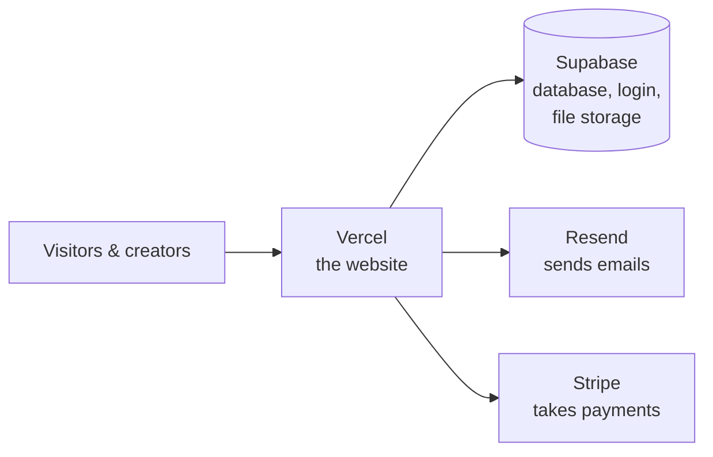
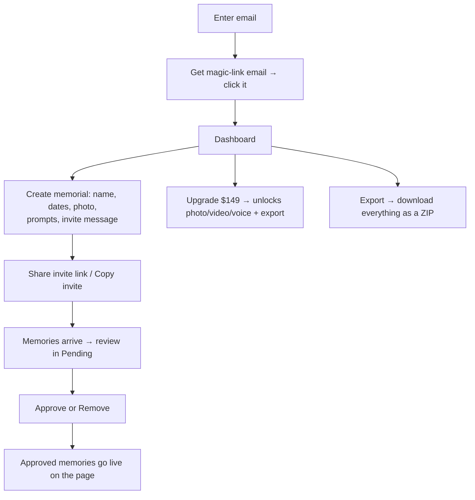
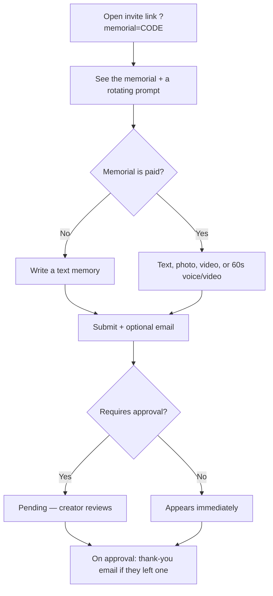
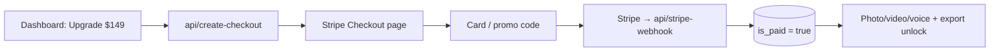

# And Then — The Complete Guide

A plain-English guide to how this site works and how to change it with Claude.
If you're picking this up to build on it: read this once, then keep
[CLAUDE.md](CLAUDE.md) open (that's the file Claude reads to learn the rules).

- **What it is:** a memorial site. Someone creates a page for a person who died,
  shares one link, and friends/family add memories (stories, photos, video,
  voice). The creator approves what appears.
- **Live at:** myandthen.com

---

## 1. The four moving parts

You don't run any servers. The site is stitched together from four services:



| Part | What it does | Where you manage it |
|---|---|---|
| **Vercel** | Hosts the website; runs the small backend functions in `api/` | vercel.com → project `andthen-civ6` |
| **Supabase** | The database, magic-link login, and photo/video/voice storage | supabase.com → "And Then" project |
| **Resend** | Sends the thank-you / notification / anniversary emails | resend.com → the `staciharv` workspace |
| **Stripe** | Collects the $149 upgrade payment | dashboard.stripe.com |
| **Domain (DNS)** | myandthen.com | Squarespace (DNS served by Google) |

**The app itself** is React (built with Vite). One page per file. There is **no
separate backend server** — the few server bits are small "serverless functions"
in the `api/` folder that Vercel runs on demand.

---

## 2. Who can do what

- **Creator (steward):** signs in with a magic link (no password), creates a
  memorial, moderates memories, can upgrade to paid. Owns the memorial.
- **Contributor:** never signs in. Opens the invite link, adds a memory.
- **Visitor:** opens the memorial link, reads the approved memories.

---

## 3. The user journeys (how it works today)

### Creator


### Contributor (no account)


### Visitor
Opens `myandthen.com/?memorial=CODE` → sees the person's page and all **approved**
memories. That's it — no login, and the link works forever.

---

## 4. Free vs. Paid

| | Free | Paid — **$149 one-time, per memorial** |
|---|---|---|
| Memorial page + 1 cover photo | ✓ | ✓ |
| Prompts + text memories | ✓ | ✓ |
| **Photo / video / voice** memories | — | ✓ |
| **Export** everything (ZIP) | — | ✓ |
| **Anniversary emails** | — | ✓ |

The creator pays; contributors never pay. Discount codes are supported (create
them in Stripe). Payment is a one-time charge — no subscriptions.

---

## 5. The data (Supabase)

Two tables do the real work. Full structure is in
[`supabase/schema.sql`](supabase/schema.sql).

**`memorials`** — one row per memorial page:
- `name`, `born`, `passed`, `description`, `photo_url` — the basics
- `steward_id` — the creator's user id (who owns it)
- `invite_code` — the code in the share link (`?memorial=<code>`)
- `require_approval` — moderation on/off
- `prompts` (up to 3) / `prompt` (old single, kept for back-compat)
- `invite_message` — the message "Copy invite" copies
- `is_paid` — the paid upgrade flag (**only the payment system can set this**)

**`contributions`** — one row per memory:
- `memorial_id` — which memorial it belongs to
- `contributor_name`, `contributor_relation`, `contributor_email` (email is kept
  private — not readable by the public)
- `type` — `story` | `photo` | `video` | `voice`
- `text`, `media_url` — the content
- `status` — `pending` | `approved` | `rejected`
- `thanked_at`, `notified_at` — so emails send once

Photos/videos/voice files live in a Supabase **Storage** bucket called
`memorial-media`. (`profiles` is a leftover table the app doesn't use.)

### The safety rules (RLS)
Supabase uses "Row Level Security" so the public key can't do damage:
- Anyone can **read approved** memories and any memorial.
- Anyone can **submit** a memory (contributors have no account).
- Only a memorial's **creator** can see pending memories, approve/remove them,
  or edit the memorial.
- `is_paid` and contributor emails can **only** be set/read by the server, never
  from the browser.

**If a save silently does nothing, suspect a missing/incorrect RLS policy before
suspecting the code.**

---

## 6. The emails (Resend)

| Email | When | To whom |
|---|---|---|
| **Thank-you** (`api/thank-you.js`) | a memory is approved (or auto-approved) and the contributor left an email | the contributor |
| **New-memory notice** (`api/notify-creator.js`) | a memory is submitted (max 5/day per memorial) | the creator |
| **Anniversary** (`api/anniversary-cron.js`) | daily check; on a birth/passing anniversary (paid only) | the creator |

All send from `hello@myandthen.com` via Resend.

---

## 7. The payment flow (Stripe)



Currently in **Stripe test mode**. To take real money: swap the Stripe key to the
**live** key + add a live webhook (waiting on the business bank account).

---

## 8. Where everything lives

```
src/
  app.jsx            the router (which page shows)
  styles.js          ALL the styling + brand colors/fonts
  lib/               supabase.js (DB client) · utils.js · router.js · export.js
  components/         Toast (popups) · Nav
  pages/              Home · Auth · CreateMemorial (create+edit) · Dashboard · Memorial
api/                 backend functions: thank-you, notify-creator,
                     create-checkout, stripe-webhook, anniversary-cron
supabase/
  migrations/         database changes (run these by hand — see §9)
  schema.sql          snapshot of the database structure
```

**Secrets & config** are NOT in the code — they live as environment variables in
Vercel (Settings → Environment Variables):
`VITE_SUPABASE_URL`, `VITE_SUPABASE_ANON_KEY`, `SUPABASE_SERVICE_ROLE_KEY`,
`RESEND_API_KEY`, `RESEND_FROM`, `STRIPE_SECRET_KEY`, `CRON_SECRET`.

---

## 9. Your environments (production vs. staging)

One codebase, three places it runs:

| Environment | Branch | Where | What it's for |
|---|---|---|---|
| **Production** | `main` | myandthen.com | The live site families use |
| **Preview (staging)** | `staging` (or any other branch) | a temporary `…vercel.app` URL Vercel makes for each push | Trying changes before they go live |
| **Development** | — | `localhost:5173` (`npm run dev`) | Your own machine while editing |

- Pushing to **`main`** auto-deploys to **production**. Pushing to **`staging`**
  auto-creates a **preview** deploy you can click through first.
- **⚠️ All three share ONE Supabase database.** There's no separate "test"
  database — anything you add or delete on localhost or a preview touches the
  **real** data. Be mindful while testing, and clear out test memories before
  real families arrive.
- **Config & secrets** (Supabase / Resend / Stripe keys) live in **Vercel →
  Settings → Environment Variables** (set for both Production and Preview), never
  in the code. If you change one, **redeploy** for it to take effect.
- **Normal flow:** edit on `staging` → preview it (localhost or the preview URL)
  → merge `staging` → `main` to go live. Full steps in [DEPLOY.md](DEPLOY.md).

---

## 10. Making changes with Claude ("vibe coding")

You can absolutely do this. The workflow:

1. **Open the project folder in Claude Code** and tell it what you want in plain
   language ("make the homepage headline say X", "add a field for the person's
   hometown", "change the upgrade price to $129").
2. Claude reads **CLAUDE.md** automatically and follows the repo's conventions.
3. **Run it locally to see changes:** in Terminal, `npm run dev`, open
   http://localhost:5173. Edits show instantly. (This is *not* a MAMP/WordPress
   site — `npm run dev` is how you preview it.)
4. **Deploy** by pushing to GitHub — see [DEPLOY.md](DEPLOY.md). Short version:
   work on the `staging` branch, then merge to `main`; Vercel deploys `main` to
   myandthen.com automatically.

### The guardrails (what to watch for)
- **Database changes need a manual step.** If a change adds/edits a database
  column, Claude writes a file in `supabase/migrations/` — you then **paste it
  into Supabase → SQL Editor and run it**. Claude cannot change the database
  directly. (If a new feature "saves nothing," the migration probably wasn't run.)
- **After changing Vercel environment variables, redeploy** — they don't take
  effect until the next deploy.
- **The `api/` functions only run on the deployed site**, not on localhost. So
  emails and payments are tested on Vercel, not locally.
- **Never commit the `.env` file** (it holds keys). It's already ignored.
- **Test a real save, not just the look.** A change can *look* fine and still
  break on save — always click through an actual action (submit/approve/sign-in).

### Common "how do I…" recipes
- **Change wording:** it's in `src/pages/*.jsx` (or `src/styles.js` for looks).
- **Add a memorial field:** migration to add the column + edit `CreateMemorial.jsx`
  (form) and wherever it's shown. (The `prompt`/`invite_message` fields are good
  patterns to copy.)
- **Change the price:** `UPGRADE_PRICE_CENTS` env var in Vercel, or the default in
  `api/create-checkout.js`.
- **Tweak an email:** the wording is in the matching `api/*.js` file.

---

## 11. Gotchas we already hit (so you don't have to)
- **Supabase free tier auto-pauses** after ~7 days idle and takes the site down.
  It's on the **Pro** plan now — keep it there.
- **Media uploads need storage policies** (fixed) — if uploads ever break, check
  the `memorial-media` bucket's policies.
- **Env-var changes require a redeploy** to take effect.
- **`App.jsx` and `app.jsx` are the same file** on a Mac (case-insensitive) — the
  real entry is lowercase `app.jsx`.
- **Don't read a row back you can't see:** an anonymous insert can't `.select()`
  a pending row (RLS hides it) — it rejects the whole insert. (Relevant if you
  touch the contribute flow.)

---

## 12. Accounts checklist (for the owner)
- **Supabase** — "And Then" project (Pro plan). Holds the database, logins, files.
- **Vercel** — project `andthen-civ6` (production = myandthen.com). Holds the env vars.
- **Resend** — `staciharv` workspace; domain `myandthen.com` verified.
- **Stripe** — the $149 product; test mode now, live when the business bank is set.
- **Domain** — Squarespace (DNS on Google nameservers).
- **GitHub** — `staciharv-afk/andthen` (the code).

Keep the keys for these somewhere safe (a password manager). Rotate any key that
ever gets shared in a chat or screenshot.
